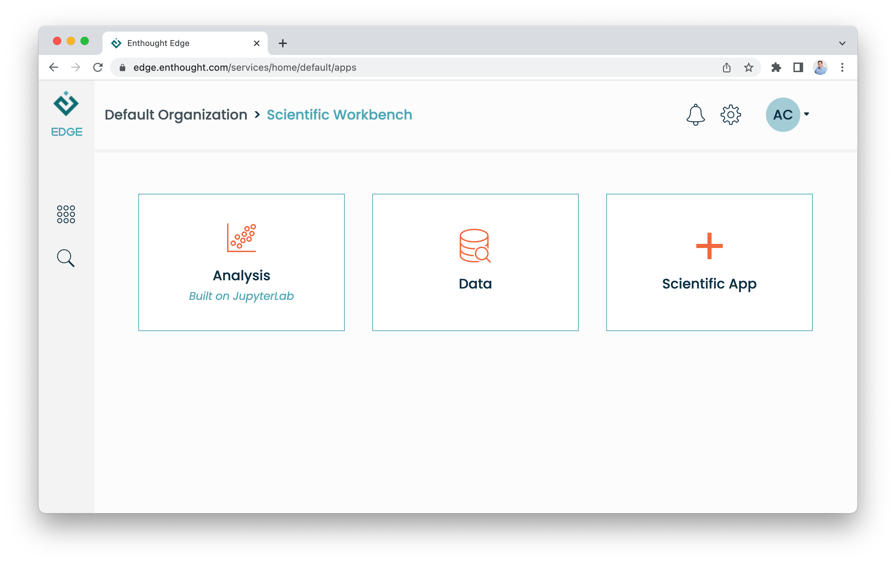

Enthought Edge
==========================================================

Welcome to Enthought Edge!

To dive right in, start with :doc:`use/getting_started`.

For an overview of managing data in Edge, see :doc:`use/files` or
:doc:`use/connectors`.

Finally, for a complete overview of the Edge Python API, see
:doc:`ref/python_api`.

Contents
--------

.. toctree::
   :maxdepth: 2
   :caption: Using Edge

   use/getting_started
   use/files
   use/connectors

.. toctree::
   :maxdepth: 2
   :caption: Reference

   ref/python_api
