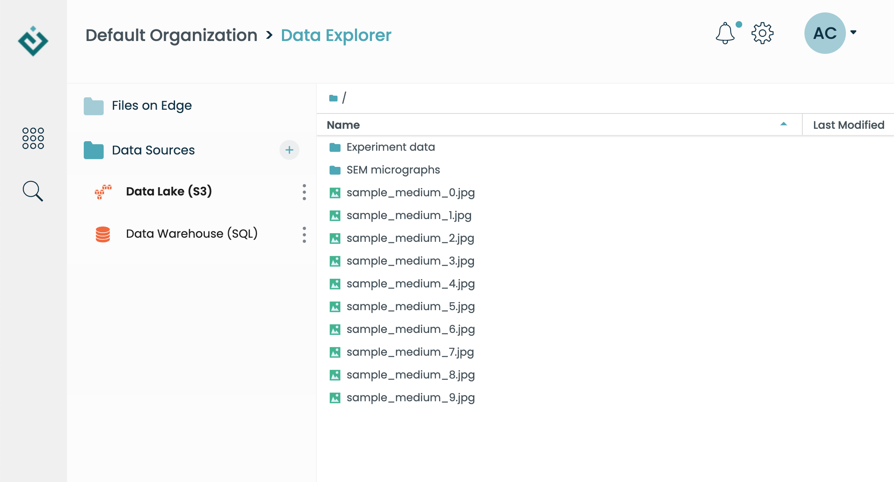
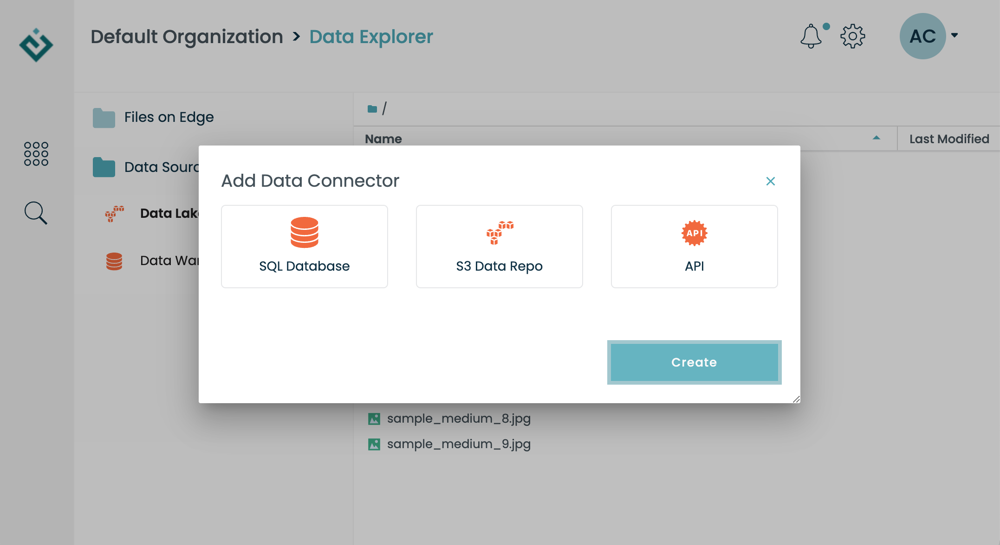
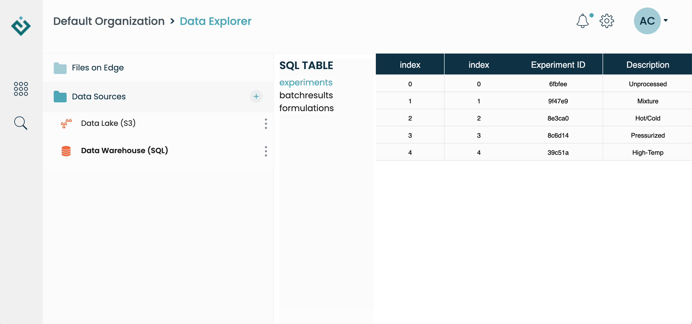

Working with Data Connectors
============================

In addition to the Edge internal file store (:doc:`files`), you can configure
Edge to connect to external data sources such as SQL databases and S3 buckets.
*Data connectors* are the mechanism to address this.

A data connector is a record in Edge which points to a remote resource (SQL
database, S3 bucket, HTTP API), combined with a standard Python API for
retrieving data.  This makes it very easy to access information directly from a
Jupyter notebook.

Managing connectors in the Data App
-----------------------------------

Probably the easiest way to get started with data connectors is by browsing in
the Data App.  Even if your administrator has not given you access to create connectors
yourself, you can still view the contents of existing connectors.
For example, here are the contents of a remote S3 bucket, displayed in the
Data App:

To create a new connector (if you have the required permissions), click on
the "+" button and a dialog will prompt you to select a connector type and
fill out basic information.  The various types are described in this document.

Working with connectors in Python
---------------------------------

The built-in EdgeSession (``edge``) object in your Jupyter notebook will allow
you to access data connectors, via the ``edge.sources`` attribute.  Here's
how the two connectors (SQL and S3) above show up in Python::

    >>> edge.sources.list_names()
    ['data-warehouse-sql', 'data-lake-s3']

You'll notice the names are a little different than they appear in the Data
App user interface.  That's because each connector has a "short name"
(``data-warehouse-sql`` or ``data-lake-s3`` in this example), as well as a
"title"  (``Data Warehouse (SQL)`` and ``Data Lake (S3)``).

To retrieve a connector, use its short name:

    >>> conn = edge.sources.get('data-warehouse-sql')

The exact details of each connector's API vary, but all have some basic
attributes in common, including name and title::

    >>> conn.name
    'data-warehouse-sql'
    >>> conn.title
    'Data Warehouse (SQL)'

The SQL Connector
-----------------

The SQL connector allows you to connect to a remote SQL database.  Currently,
only PostgreSQL databases are supported.  Viewing a SQL connector in the Data
App will display a list of tables, and allows you to click on each of them to
preview the data:

In Python, you have programmatic access to both the table names and the
table contents, loaded as Pandas data frames.  Both are accessed through
the ``.tables`` attribute, which provides a dictionary-like interface::

    >>> list(conn.tables)
    ['experiments', 'batchresults', 'formulations']
    >>> table = conn.tables['experiments']
    >>> table.to_dataframe()
        index Experiment ID  Description
     0      0        6fbfee  Unprocessed
     1      1        9f47e9      Mixture
     2      2        8e3ca0     Hot/Cold
     3      3        8c6d14  Pressurized
     4      4        39c51a    High-Temp

The S3 Connector
----------------

The S3 connector allows browing the contents of a remote data store as if
it were a file system.  The Python interface borrows heavily from that used
by the Edge internal file store (:doc:`files`).  In this case, file access
begins via the ``.root`` attribute, which represents the root of the virtual
file system::

    >>> conn = edge.sources.get('data-lake-s3')
    >>> conn.root.list()
    ['Experiment data',
     'SEM micrographs',
     'sample_medium_0.jpg',
     'sample_medium_1.jpg',
     'sample_medium_2.jpg',
     'sample_medium_3.jpg',
     'sample_medium_4.jpg',
     'sample_medium_5.jpg',
     'sample_medium_6.jpg',
     'sample_medium_7.jpg',
     'sample_medium_8.jpg',
     'sample_medium_9.jpg']

Files, and nested "folders", are retrieved using ``open()``::

    >>> subfolder = conn.root.open('Experiment data')
    >>> subfolder.list()
    ['01f23764ad0b4642a374f68349c5504c.png',
     'd8d73e96bff44632985ad563eb4397cd.bin',
     'dc852dfb0b89442ab918297db9b8d727.png',
     'e004927530c74ed7ac8c510744645d55.png',
     'e38326ab94494f50ba1050b3ee704eee.bin']

   >>> myfile = conn.root.open('sample_medium_0.jpg')
   >>> type(myfile)
   edge.api.S3File

The OpenAPI3 Connector (beta)
-----------------------------

This connector is will allow you to autogenerate a Python API based on an
OpenAPI3 JSON specification.  Here's an example of the Python API it
generates, based on the popular "Pet Store" demo HTTP API::

    >>> conn = edge.sources.get('petstore')
    >>> client = conn.generate_new_client()
    >>> pets = client.pet.findPetsByStatus()

In this example, the ``findPetsByStatus`` method is automatically generated
based on information available in the remote HTTP definition.  You can
browse that definition here: https://petstore3.swagger.io/
