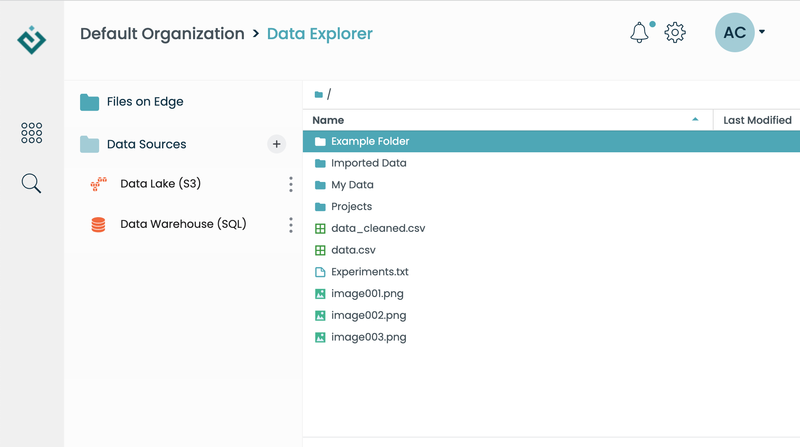
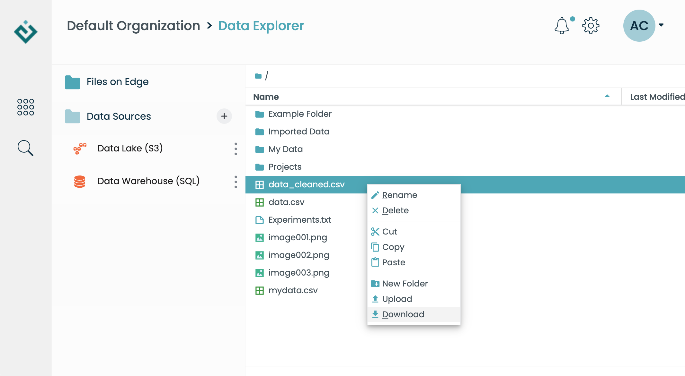
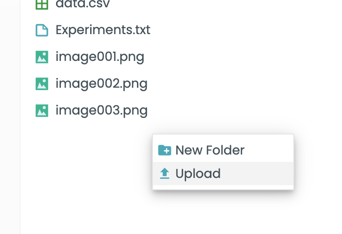

Working with Files
==================

Edge provides a highly scalable built-in storage space for files and folders.
This is in addition to data accessed remotely with Data Connectors, and the local
files managed in the Analysis App.

Files stored in Edge's *internal storage* can be accessed by multiple users in
your organization; they are also accessible in Jupyter notebooks via the
``edge`` built-in object.  Note that while files are accessible to all users of
your organization, they cannot be viewed or modified by anyone *outside* of your
organization.

Probably the easiest way to get started with files is by using the interactive
file browser in the Data App.  This approach lets you upload files using a
simple drag-and-drop approach:

Browsing and opening files
--------------------------

You can explore your files interactively using the Data App file viewer.  But
files and folders can also be accessed programmatically via the EdgeSession
object automatically added to your Jupyter notebook.  For example, to list
the contents of the *root folder* (top of the file tree), simply call
``edge.files.list()``::

    >>> edge.files.list()
    ['Example Folder',
     'Experiments.txt',
     'Imported Data',
     'My Data',
     'Projects',
     'data.csv',
     'data_cleaned.csv',
     'image001.png',
     'image002.png',
     'image003.png']

You can use this interface to open either files or folders.  Here, we open
the "Imported Data" folder and assign it to a variable in the notebook.  Not
surprisingly, opening a folder gives you a Folder object::

    >>> imported_folder = edge.files.open("Imported Data")
    >>> type(imported_folder)
    edge.api.Folder

Listing the contents of this subfolder shows the files it contains::

    >>> imported_folder.list()
    ['datacapture001.png', 'datacapture002.png']

This lets you explore the file tree step-by-step, by opening folders and
subfolders in turn.

Of course, you can open an individual file, too.  What do you get in return?
That depends on the file type.  For example, if we open the "data.csv" file
in the root folder, Edge will automatically convert it to a Pandas dataframe for
us::

    >>> data = edge.files.open("data.csv")
    >>> type(data)
    pandas.core.frame.DataFrame

Likewise, if we open an image file, we get a Python Imaging Library (PIL)
image object::

    >>> data = edge.files.open("image001.png")
    >>> type(data)
    PIL.PngImagePlugin.PngImageFile

Finally, if we just want the bytes of the file, we can get a raw "file-like"
object by requesting that Edge open the file with a particular handler::

    >>> data = edge.files.open("image001.png", open_with="file")
    >>> type(data)
    edge.api.File

    >>> databytes = data.read()
    >>> type(databytes)
    bytes

Downloading a file
------------------

To download a file from the Data App file browser to your desktop, simply
right-click on the file and select "Download":

Of course, you can also download a file via the Edge API.  Every ``Folder``
object in Edge has a ``download()`` method.  Just specify the name of the file
you want to retrieve::

    >>> edge.files.download('image002.png')

If you list the contents of your Analysis App home directory, you'll see the
downloaded file show up::

    $ ls
    MyNotebook.ipynb   image002.png

Uploading files to Edge
-----------------------

The simplest way to upload a file from your desktop to Edge is by dragging and
dropping it into the Data App file browser.  Small files will show up
immediately; for larger files you will get a progress bar that fills as the
upload progresses.  You can also right-click anywhere in the file browser
and select "Upload", which will open a window prompting you to select the file
to upload:

You can also upload files programmatically, using ``edge.files``.  Here's an
example.  Suppose you have a file called ``mydata.csv`` in your Analysis App
local file tree.  Then, to upload it to the root folder in Edge's internal
file storage, you would open the file and pass it to ``edge.files.upload``::

    >>> with open('mydata.csv', 'rb') as myfile:
    ...     edge.files.upload('mydata.csv', myfile)

Other file management operations
--------------------------------

In the right-click menus for the Data App file browser, you'll find multiple
options to move or rename files & folders, in addition to the upload/download
options described above.  These also have counterparts in the Edge Python API.

For example, we can make a new folder in the root by calling ``make_folder``::

    >>> edge.files.make_folder('newfolder')

If we don't like the name, we can change it::

    >>> edge.files.rename('newfolder', 'New Folder')

We can even move it into another folder::

    >>> edge.files.move('New Folder', 'Imported Data/New Folder')
