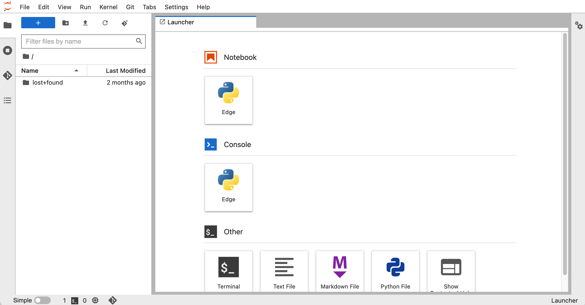

Getting Started
===============

Basic Concepts
--------------

Enthought Edge brings several capabilities together into one product.  Before
getting started, it's useful to review them briefly.  The basic parts of Edge
are:

* An :doc:`internal data store <files>`, using a file/folder metaphor
* A collection of :doc:`data connectors <connectors>`, which you can use to connect Edge to vast
  quantities of pre-existing data in your organization
* The :ref:`Analysis App <analysis_app>` (JupyterLab), where you can write notebooks to analyze data,
  and instantly access Edge's files and data connectors from Python
* The :ref:`Data App <data_app>`, where you can browse & edit files and connector data interactively
* A :ref:`Search <search_tool>` tool, which you can use to rapidly locate data of interest
* A fast, modern :ref:`API <python_api>` you can use for analysis or building
  custom applications

Logging in
----------

Go to https://edge.enthought.com, and you should see a page prompting you to
log in.  Clicking on "Login" will prompt you to enter the username and password
for your Enthought account:

Scientific Workbench
--------------------

Once you've logged, in the *Scientific Workbench* will be displayed.  This
is where applications (custom or built-in to Edge) are shown.  Edge ships with
two built-in applications: the Analysis App (built on JupyterLab), and the
Data App.

.. _analysis_app:

Using the Analysis App
----------------------

Click on the "Analysis" tile to launch.  This will take a few minutes as the
application starts.  When it finishes, you should see a customized version of
JupyterLab:

Jupyter notebooks
~~~~~~~~~~~~~~~~~

From here, you can create Jupyter Notebooks.  There is a predefined object
in each notebook, called ``edge``:

As you can read in :doc:`files` and :doc:`connectors`, this built-in object
gives you access to a vast amount of data accessible via Edge's API.  That
includes uploaded files and other data, as well as remote data sources Edge
has been connected to.

For example, here's how you can list uploaded files and folders in Edge's
internal storage::

    >>> edge.files.list()
    ['Example Folder',
     'Experiments.txt',
     'Imported Data',
     'My Data',
     'Projects',
     'data.csv',
     'data_cleaned.csv',
     'image001.png',
     'image002.png',
     'image003.png']

Installing Python packages
~~~~~~~~~~~~~~~~~~~~~~~~~~

A large number of Python packages are pre-installed.  You can also install
different ones; open a terminal from the Jupyter launcher page and use
``edm`` or ``pip`` commands to install::

    $ edm install somepackage
    $ pip install somepackage

.. note::

    If you have a notebook open, you can get the launcher page back via the
    large blue "+" button at top left:

    .. image:: static/edge_analysis_launcher.png
      :scale: 50%

We recommend using ``edm`` unless the package you want isn't available from
Enthought's repository.  ``edm``-installed packages have been extensively
tested to make sure they work together.  You can read more about EDM
in the `official EDM docs <https://docs.enthought.com/edm/>`_.

If you get into trouble, shut down any running notebooks and run the
``reset-edge`` command from the terminal.  This will restore your package set to
the "factory default" settings::

    $ reset-edge

    Resetting Edge will:

      * remove all custom Python packages and environments
      * restore your Python packages to factory default

    You will NOT lose any files or notebooks.

    Continue and reset Edge (y/n)?

.. _data_app:

Using the Data App
------------------

Clicking on the "Data" tile will launch the Data App, which allows browsing
of data uploaded to Edge or available through a data connector.

For details on using the built-in file browser in the Data App, see
:doc:`files`.

For details on creating and managing data connectors in the Data App,
see :doc:`connectors`.

.. _search_tool:

Using the Search Tool
---------------------

Clicking on the search icon in the left sidebar will bring you to the Search
tool.  This allows you to search data known to Edge.  Currently files and
filenames in Edge's internal storage are indexed:

